# Building an AI Store Operations Agent for Creem with OpenClaw

Your Creem store generates events all day — new sales, failed payments, cancellations, upgrades, downgrades. If you're a solo founder or a small team, checking the dashboard every few hours is not sustainable. You miss things. A payment fails on Friday night, and you don't notice until Monday. A customer cancels, and by the time you react, they're gone.

This guide shows you how to build an AI agent that monitors your Creem store 24/7. It doesn't just send alerts — it analyzes situations and takes action. When someone cancels, the agent calculates their lifetime value, decides whether to offer a discount, and executes it. No human in the loop unless the agent isn't confident enough.

## Architecture

The agent uses three layers, each solving a different problem:

```mermaid
graph LR
    subgraph CREEM ["🏪 Creem Store"]
        EVENT["<b>1. Something happens</b><br/>New sale, cancellation,<br/>failed payment"]
    end

    subgraph WEBHOOKBRIDGE ["🌉 Webhook Bridge"]
        VERIFY["<b>2. Verify & log</b><br/>Check signature,<br/>save to audit log"]
        WAKE["<b>3. Wake the agent</b>"]
        VERIFY --> WAKE
    end

    subgraph OPENCLAW ["🧠 OpenClaw Agent"]
        DETECT["<b>4. Detect changes</b><br/>Query the store,<br/>compare with last state"]
        DECIDE["<b>5. Analyze & decide</b><br/>Customer LTV, tenure,<br/>confidence score"]
        ACT["<b>6. Take action</b><br/>Create discount,<br/>pause subscription,<br/>or let it go"]
        DETECT --> DECIDE --> ACT
    end

    subgraph YOU ["📱 You"]
        NOTIFY["<b>7. Get notified</b><br/>What happened +<br/>what the agent did"]
    end

    EVENT --> VERIFY
    WAKE --> DETECT
    ACT --> NOTIFY

    style CREEM fill:none,stroke:#43A047,stroke-width:2px,stroke-dasharray:5 5,color:#1B5E20
    style WEBHOOKBRIDGE fill:none,stroke:#FB8C00,stroke-width:2px,stroke-dasharray:5 5,color:#E65100
    style OPENCLAW fill:none,stroke:#1E88E5,stroke-width:2px,stroke-dasharray:5 5,color:#0D47A1
    style YOU fill:none,stroke:#8E24AA,stroke-width:2px,stroke-dasharray:5 5,color:#6A1B9A

    style EVENT fill:#E8F5E9,stroke:#43A047,stroke-width:2px,color:#1B5E20
    style VERIFY fill:#FFF3E0,stroke:#FB8C00,stroke-width:2px,color:#E65100
    style WAKE fill:#FFF3E0,stroke:#FB8C00,stroke-width:2px,color:#E65100
    style DETECT fill:#E3F2FD,stroke:#1E88E5,stroke-width:2px,color:#0D47A1
    style DECIDE fill:#E3F2FD,stroke:#1E88E5,stroke-width:2px,color:#0D47A1
    style ACT fill:#E3F2FD,stroke:#1E88E5,stroke-width:2px,color:#0D47A1
    style NOTIFY fill:#F3E5F5,stroke:#8E24AA,stroke-width:2px,color:#6A1B9A
```



### Layer 1: Webhooks — Real-time event processing

When something happens in your Creem store, the platform fires a webhook event. Our lightweight bridge service (`bridge/webhook-receiver.ts`) receives it, verifies the HMAC-SHA256 signature to confirm it's authentic, deduplicates it by event ID, and logs it to `events.jsonl` as an audit trail.

Then it calls OpenClaw's `/hooks/wake` endpoint, which wakes up the agent. The agent reads the event, classifies it by severity, and takes the appropriate action. A new sale? Good news notification on Telegram. A failed payment? Alert with customer context. A cancellation? Full churn analysis.

The bridge is intentionally thin — about 90 lines of TypeScript running on Bun with zero external dependencies beyond Hono for routing. It doesn't make decisions. It just makes sure the event is real, logs it, and hands it off to the brain. If you need to audit what happened, `events.jsonl` has every verified event with timestamps, customer IDs, and the full raw payload.

### Layer 2: CLI — Active control

The [Creem CLI](https://github.com/santigamo/creem-cli-developer-toolkit) is how the agent interacts with your store. It can list customers, inspect subscriptions, check transaction history, create discounts, pause subscriptions, and more — all from the terminal.

This is what makes the agent more than a notification bot. When the churn analysis says "offer a 20% discount to retain this customer," the agent actually does it. It runs `creem discounts create`, then notifies you on Telegram with what it did and why.

The CLI uses the same Creem API you'd use from the dashboard, but it's terminal-native — which means an AI agent can use it directly. No API client libraries, no SDK, no code to maintain.

### Layer 3: Heartbeat — Periodic health monitoring

Webhooks are fast, but they're not 100% reliable. Networks fail, services go down. The heartbeat is your safety net.

Every 30 minutes, OpenClaw's native heartbeat system triggers the agent to run a full store health check. The agent:

1. Loads the previous state from `~/.creem/heartbeat-state.json`
2. Queries the store for current transactions, subscriptions, and customers
3. Compares the two snapshots
4. Reports any changes — or stays silent if nothing happened

This means even if a webhook gets lost, the heartbeat catches it within 30 minutes. The state file persists across restarts, so the agent never loses track of where it was.

## Proactive Workflows

The agent handles all 13 Creem webhook events, but three workflows stand out:

### Failed payment alerts

When a subscription goes `past_due`, the agent doesn't just say "payment failed." It fetches the customer's details, checks their transaction history (first-time failure vs. repeat offender), and sends you a Telegram alert with full context:

- Customer email and product
- Payment amount
- How long they've been a subscriber
- Whether this is a recurring problem

This context matters. A first-time failure on a $200/month enterprise customer deserves more attention than a repeat failure on a $5 trial.

### Churn detection and autonomous retention

This is the agent's most powerful workflow. When a subscription is canceled or scheduled for cancellation:

1. The agent fetches the customer's full history — product, plan, country, subscription age
2. It calculates their lifetime value by summing all transactions
3. It analyzes the situation and chooses one of three actions:
   - **Create a retention discount** — for high-value customers worth saving
   - **Suggest pausing** — for customers who might come back later
   - **No action** — for very new or low-value customers

4. If the agent's confidence is **80% or higher**, it executes the action autonomously and notifies you after the fact
5. If confidence is **below 80%**, it sends you a recommendation on Telegram and waits for approval

This confidence-based execution model means the agent handles the clear cases on its own (saving you time) while escalating the ambiguous ones (keeping you in control). You get the best of both worlds: automation without blind trust.

### Daily revenue digest

Every day, the agent generates a summary of your store's activity:

- Total revenue for the day
- Number of new transactions and customers
- Subscription changes (new, canceled, upgraded, downgraded)
- Active subscriber count
- Comparison with the previous day

This replaces the "open the dashboard and squint at graphs" ritual. One Telegram message, every morning, with everything you need to know.

## Natural Language Queries

You don't need to memorize CLI commands. Just ask the agent in plain English:

- "How much revenue did we make this week?"
- "How many active subscribers do we have?"
- "Who cancelled today?"
- "Show me the last 10 transactions"
- "What products do we have?"

The agent translates your question into the right CLI commands, runs them, and gives you a human-readable answer. This works because OpenClaw agents have full access to the tools defined in their skills — the Creem CLI is just another tool.

## Setup

### Prerequisites

- [OpenClaw](https://docs.openclaw.ai/) installed and running
- [Creem CLI](https://github.com/santigamo/creem-cli-developer-toolkit) installed and authenticated
- A Creem API key (test mode recommended to start)
- A Telegram bot (create one via [@BotFather](https://t.me/botfather))
- [Bun](https://bun.sh/) runtime (for the webhook bridge)
- [ngrok](https://ngrok.com/) (to expose the webhook bridge to the internet)

### Step 1: Install the skills

```bash
# Install the Creem CLI skill
npx skills add santigamo/creem-cli-developer-toolkit

# Install the Creem Store Agent skill
clawhub install creem-store-agent
```

### Step 2: Set up the workspace

Copy the agent instructions and heartbeat config to your OpenClaw workspace:

```bash
cp AGENTS.md ~/.openclaw/workspace/
cp HEARTBEAT.md ~/.openclaw/workspace/
```

### Step 3: Configure the webhook bridge

```bash
cp .env.example .env
```

Fill in your `.env`:

```bash
CREEM_WEBHOOK_SECRET=your_signing_secret   # From Creem dashboard → Webhooks
OPENCLAW_HOOKS_TOKEN=your_gateway_token    # From OpenClaw gateway config
WEBHOOK_PORT=3000
```

### Step 4: Start the bridge and tunnel

```bash
# Terminal 1: webhook bridge
pnpm install
pnpm webhook

# Terminal 2: ngrok tunnel
ngrok http 3000
```

Copy the ngrok public URL and register it in the Creem dashboard as your webhook endpoint:
```
https://your-ngrok-url.ngrok-free.app/api/webhooks/creem
```

### Step 5: Tell the agent about Telegram

Send your Telegram bot token and chat ID to the agent — it stores them in its memory and uses them for all notifications.

That's it. The agent starts monitoring on the next heartbeat cycle (every 30 minutes), and processes webhook events in real-time.

## How to Extend

The agent is built with standard OpenClaw patterns, so extending it is straightforward:

- **Add more notification channels** — The skill can be modified to send alerts to Slack or Discord instead of (or in addition to) Telegram
- **Custom retention logic** — Edit the churn analysis section in `skills/creem-store-agent/SKILL.md` to adjust confidence thresholds or add new retention strategies
- **Additional workflows** — Add dispute handling, upgrade celebration messages, or weekly trend reports by extending the skill
- **Multiple stores** — Run separate OpenClaw agents with different Creem API keys, each monitoring its own store

The key design principle is that the agent's behavior is defined in plain text files (SKILL.md, AGENTS.md, HEARTBEAT.md). No code to compile, no plugins to build. You edit markdown, restart the gateway, and the agent adapts.

## Conclusion

An AI store operations agent is not about replacing human judgment — it's about making sure nothing falls through the cracks. Failed payments get caught immediately. Cancellations get analyzed before they're forgotten. Revenue summaries arrive without you asking.

The three-layer architecture (webhooks + CLI + heartbeat) gives you speed, control, and reliability. The confidence-based execution model gives you automation without blind trust. And because it's all built on OpenClaw skills, the entire thing is portable, shareable, and extensible.

Your store never sleeps. Now your monitoring doesn't have to either.

---

*This agent was built for the OpenClaw + CREEM AI Agent Worker Bounty. The full source code, skills, and setup instructions are available on [GitHub](https://github.com/santigamo/creem-openclaw-agent). Questions or feedback? Open an issue or reach out on X [@imsantigamo](https://x.com/imsantigamo).*
